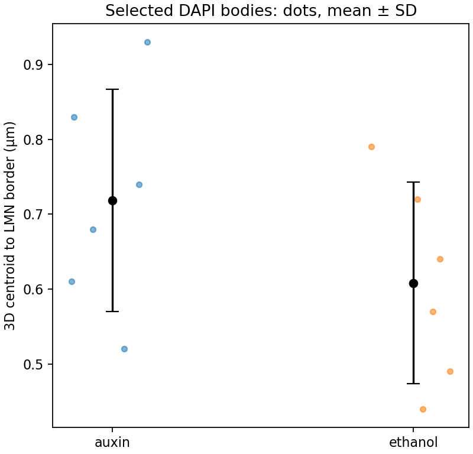

# Examples

The two CSV files here contain **synthetic, illustrative values**. They are useful for checking the plotting command and its output format. They are not microscopy measurements and should not be used for biological inference.



From the repository root:

```sh
python plot_conditions.py \
  examples/auxin_selected_example.csv \
  examples/ethanol_selected_example.csv \
  --output condition_comparison.png
```

For real image analysis, put your deconvolved `*_R3D_D3D.dv` files in a separate input folder and run:

```sh
python run_diakinesis.py \
  --input /path/to/dv_files \
  --output /path/to/new_results \
  --condition auxin
```

Check `config.yaml` against the image metadata before running. The generated `measurements_selected.csv` files can then be passed to `plot_conditions.py` in the same way as the synthetic CSVs above.
